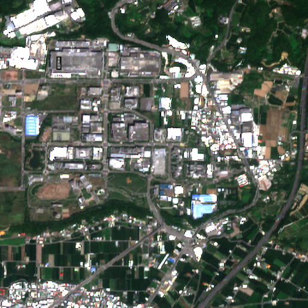
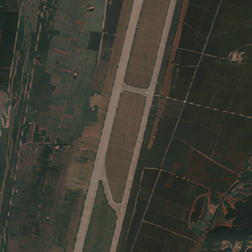

# Diff-Trans-TEL: Diffusion-Transformer Pipeline for TEL Data Augmentation

A three-stage data augmentation framework for **TEL (Transporter-Erector-Launcher)** vehicle recognition in aerial/satellite imagery.  
Synthetic training data is generated end-to-end by chaining **Textual Inversion (Stable Diffusion)**, **geometry-aware object compositing**, and **MAT inpainting**.

---

## Overview

Annotated TEL imagery is extremely scarce due to the sensitive nature of military assets.  
This pipeline addresses the data scarcity problem by synthesizing realistic augmented aerial scenes from a handful of reference images per TEL class.

### Pipeline Architecture

```
[Real TEL images]
       │
       ▼
┌─────────────────────────────────────────────────────────┐
│  Stage 1 · Diffusion-based TEL Synthesis                │
│  fine_tune.py ──► generate_images.py                    │
│  Textual Inversion on Stable Diffusion v1-4             │
│  → diverse white-background TEL images                  │
└─────────────────────────┬───────────────────────────────┘
                          │
                          ▼
┌─────────────────────────────────────────────────────────┐
│  Stage 2 · Object Compositing                           │
│  extract_masks.py    (polygon mask extraction)          │
│  insert_objects.py   (angle-aware compositing)          │
│  → composited scene + inpainting mask + YOLO labels     │
└─────────────────────────┬───────────────────────────────┘
                          │
                          ▼
┌─────────────────────────────────────────────────────────┐
│  Stage 3 · MAT Inpainting                               │
│  generate_image.py   (Mask-Aware Transformer)           │
│  → seamlessly blended augmented scene images            │
└─────────────────────────────────────────────────────────┘
```

### Stage 1 — Diffusion-based TEL Synthesis

- Fine-tunes a **Textual Inversion** embedding for each TEL class (e.g. `<buk_m2>`) using as few as **3–5 reference images**.
- The learned token is injected into the CLIP text encoder of Stable Diffusion v1-4.
- Inference generates diverse, clean **white-background TEL images** for use in Stage 2.

### Stage 2 — Geometry-Aware Object Compositing

**2a — Mask extraction** (`stage2_compositing/extract_masks.py`):
- Extracts precise RGBA cutouts from the white-background Stage 1 outputs.
- Uses **polygon approximation** (approxPolyDP, ε = 0.8% of perimeter) to produce smooth, hole-free silhouettes.
- `sync_masks.py` removes object files whose mask was manually deleted during review.

**2b — Object insertion** (`stage2_compositing/insert_objects.py`):
- Places objects onto real aerial/satellite backgrounds at manually annotated spots.
- **PCA-based angle alignment** rotates each object to match road/parking geometry.
- Scale is set to 2–2.5% of image width (realistic aerial resolution) with ±5% jitter.
- Supports both fixed (`scale_pct`) and range (`scale_range`) scale modes per background.
- Outputs: composited RGB image, inpainting boundary mask, and **YOLO-format detection labels**.
- `annotate_spots.py` is an interactive OpenCV tool to annotate placement spots on a new background image.

### Stage 3 — MAT Inpainting

- Runs **MAT** (Mask-Aware Transformer, CVPR 2022) on the composited image to seamlessly blend the boundary seam between the inserted object and the background.
- The inpainting mask from Stage 2b targets only the boundary region — the object itself is preserved intact.

---

## Sample Results

| Stage 1 · Generated TEL | Stage 3 · Before Inpainting | Stage 3 · After Inpainting |
|:---:|:---:|:---:|
|  |  |  |

---

## Repository Structure

```
Diff-Trans-TEL/
│
├── stage1_diffusion_aug/                       # Stage 1: Diffusion-based synthesis
│   ├── fine_tune.py                            # Textual Inversion fine-tuning
│   ├── generate_images.py                      # TEL image generation (inference)
│   ├── setup.py
│   └── semantic_aug/
│       ├── generative_augmentation.py          # Abstract base class
│       ├── few_shot_dataset.py                 # Base few-shot dataset loader
│       ├── augmentations/
│       │   ├── textual_inversion.py            # ★ Core: SD-based TEL augmentation
│       │   ├── real_guidance.py                # Real-image guidance variant
│       │   └── compose.py                      # Parallel / sequential aug composition
│       └── datasets/
│           └── tel.py                          # TelDataset — 13-class TEL loader
│
├── stage2_compositing/                         # Stage 2: Mask extraction + Compositing
│   ├── extract_masks.py                        # ★ Polygon mask extraction (Stage 2a)
│   ├── sync_masks.py                           # Remove orphaned object files
│   ├── insert_objects.py                       # ★ Object compositing + YOLO labels (Stage 2b)
│   ├── annotate_spots.py                       # Interactive spot & angle annotator
│   └── example/
│       └── P0042_aug_0.txt                     # Example YOLO label file
│
├── stage3_inpainting/                          # Stage 3: MAT inpainting
│   ├── generate_image.py                       # ★ MAT inference script
│   ├── train.py                                # MAT training script
│   ├── legacy.py                               # Network pickle utilities
│   ├── requirements.txt
│   ├── networks/
│   │   ├── mat.py                              # ★ MAT Generator & Discriminator
│   │   └── basic_module.py                     # StyleGAN2-based building blocks
│   ├── datasets/
│   │   ├── dataset_512.py                      # Training dataset loader (512px)
│   │   ├── dataset_512_val.py
│   │   ├── mask_generator_512.py               # Random mask generation
│   │   └── mask_generator_256.py
│   ├── losses/                                 # Training losses (GAN + perceptual)
│   ├── metrics/                                # Evaluation metrics (FID, LPIPS, etc.)
│   ├── evaluatoin/                             # Post-training evaluation scripts
│   ├── torch_utils/                            # Low-level CUDA ops (StyleGAN2-ADA)
│   └── training/                               # Training loop & augmentation
│
└── results/                                    # Sample outputs (3 images)
    ├── stage1_generated_tel.png
    ├── stage3_before_inpainting.png
    └── stage3_after_inpainting.png
```

> ★ marks the files most central to the proposed pipeline.

---

## Requirements

### Stage 1

```bash
pip install diffusers==0.10.0 transformers accelerate \
            torch torchvision Pillow scipy tqdm
```

> Stable Diffusion v1-4 weights are downloaded automatically from HuggingFace.  
> A HuggingFace account token is required (`use_auth_token=True`).

### Stage 2

```bash
pip install opencv-python Pillow numpy
```

### Stage 3

```bash
cd stage3_inpainting
pip install -r requirements.txt
```

> MAT requires a pre-trained model pickle.  
> Download `Places_512_FullData_G.pkl` from the [MAT official repository](https://github.com/fenglinglwb/MAT) and place it under `stage3_inpainting/networks/pretrained/`.

---

## Usage

### Stage 1: Fine-tune a TEL token embedding

```bash
cd stage1_diffusion_aug

# Fine-tune a new token for a specific TEL class (3–5 reference images suffice)
python fine_tune.py \
    --pretrained_model_name_or_path CompVis/stable-diffusion-v1-4 \
    --train_data_dir images/tel/<class_name>/ \
    --placeholder_token "<buk_m2>" \
    --initializer_token "vehicle" \
    --output_dir tel-tokens/<class_name>/ \
    --max_train_steps 3000

# Generate synthetic TEL images on a white background
python generate_images.py \
    --embed-path tel-tokens/<class_name>/learned_embeds.bin \
    --prompt "a photo of a <buk_m2>, white background" \
    --num-generate 50 \
    --out output/generated/<class_name>/
```

### Stage 2a: Extract object masks

```bash
cd stage2_compositing

# Extract RGBA cutouts and binary masks from white-background images
python extract_masks.py \
    --input_dir  ../stage1_diffusion_aug/output/generated/<class_name>/ \
    --output_dir extracted_results/ \
    --scale      1.0

# (Optional) remove object files whose mask was manually deleted during review
python sync_masks.py --dir extracted_results/<class_name>/
```

### Stage 2b: Annotate placement spots (one-time setup per background image)

```bash
cd stage2_compositing

# Position-only mode (angle = 0, e.g. for symmetric objects)
python annotate_spots.py --img <path/to/background.png>

# Position + angle mode (e.g. for vehicles that must align to roads)
python annotate_spots.py --img <path/to/background.png> --with-angle

# Copy the printed (x_pct, y_pct, angle_deg) tuples into BG_CONFIGS in insert_objects.py
```

### Stage 2b: Composite objects into backgrounds

```bash
cd stage2_compositing

python insert_objects.py \
    --objects_dir  extracted_results/<class_name>/objects/ \
    --bg_dir       backgrounds/ \
    --output_dir   composites/ \
    --copies_per_bg 30
```

Output structure:
```
composites/
├── images/   # composited RGB images       → Stage 3 input
├── masks/    # inpainting boundary masks   → Stage 3 input
└── labels/   # YOLO-format .txt annotation files
```

### Stage 3: MAT inpainting

```bash
cd stage3_inpainting

python generate_image.py \
    --network  networks/pretrained/Places_512_FullData_G.pkl \
    --dpath    ../stage2_compositing/composites/images/ \
    --mpath    ../stage2_compositing/composites/masks/ \
    --outdir   final_augmented/ \
    --resolution 512
```

---

## TEL Classes

The pipeline supports the following 13 TEL / MLRS vehicle classes:

| Class Name | 
|:---|
| Buk-M2 9M317 | 
| S-400 |
| SA-22 Pantsir-S | 
| Tor / Tor-M2DT | 
| Pantsir-SA |
| RS-24 Yars |
| 9K720 Iskander |
| 3K60 Bal | 
| BM-30 Smerch | 
| ISDM Zemledeliye | 
| TOS |
| etc |

---

## Acknowledgements

- [Semantic Augmentation (Trabucco et al., 2023)](https://github.com/brandontrabucco/da-fusion) — Textual Inversion augmentation framework
- [MAT (Li et al., CVPR 2022)](https://github.com/fenglinglwb/MAT) — Mask-Aware Transformer inpainting
- [Stable Diffusion (CompVis)](https://github.com/CompVis/stable-diffusion) — Base generative model
